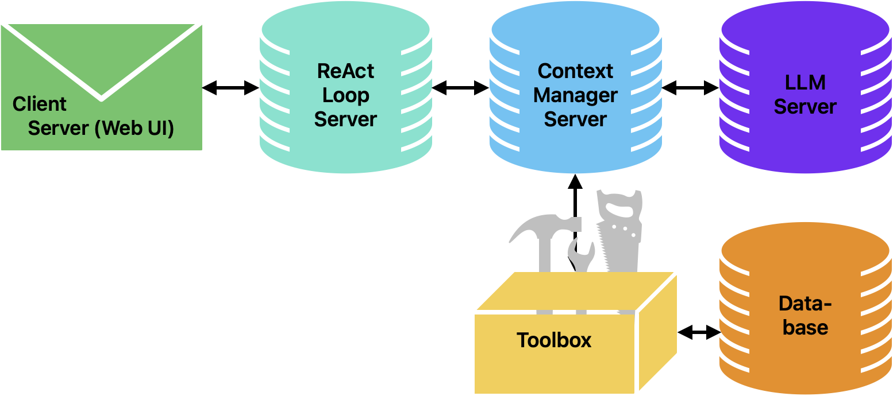
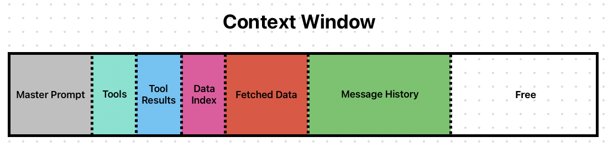

# AI Secretary v2 — Local LLM Virtual Assistant Orchestrator

CMPE 259 Natural Language Processing (SJSU) · Spring 2026 · Solo (Max Dokukin) · Status: Completed (course prototype)

## Overview

AI Secretary v2 is a local-first virtual assistant for the portfolio website maxdokukin.com, whose database holds 60 projects,
10 work experiences and 3 educations. Instead of dumping that data into the prompt or sending it to a cloud LLM, an
open-source Gemma 4 model runs locally through `llama.cpp` and retrieves what it needs with tools: a read-only SQL
`SELECT` tool, a fetch-row-by-slug tool and a web-search tool, driven by a ReAct loop. A separate ContextManager
server keeps the context in named segments (master prompt, tools, tool results, data index, fetched data, message
history), logs every session to JSON and measures how the context is used. Gemma 4 E4B and Gemma 4 26B were compared on
25 queries (20 user questions plus 5 adversarial prompts): the 26B model scored 14.3% higher on human-graded quality
but took about 4.3× longer per answer.

## Highlights

- Human-graded quality (1–3 scale, 25 queries): **2.56 for Gemma 4 26B vs 2.24 for Gemma 4 E4B** (+14.3%); 26B gave
  19 top-grade answers, E4B 15 (`doc/figures/avg_quality_score_by_model_percent_increase.png`, `data/test/test_data.numbers`).
- Mean latency per answer: **133.9 s (26B) vs 31.4 s (E4B)** from `Time_Taken_s` in `data/test/test_queries_results_*.csv`.
  Measured per unit of time, E4B delivers 4.28 quality points per minute against 1.15 for 26B.
- **All 5 adversarial prompts** (reveal system prompt, dump the database, show hidden fields, return raw tool output,
  drop a table) received the top grade from both models. The SQL tool also blocks writes at the tool layer:
  a `SELECT`-only grammar, 27 forbidden keywords, no comments or stacked queries, a read-only SQLite connection.
- Context accounting per session (characters): the data index takes 15,228 of about 20.5–20.8k (~74%). 26B fetched more data
  (3,240 vs 2,917) and E4B wrote longer answers (621 vs 565) (`doc/figures/avg_utilization_by_metric_model.png`).
- Five-service architecture (client/WebSocket UI, ReAct loop, ContextManager, ToolBox, LLMServer). Each piece can run
  locally or remotely. During evaluation the 26B model was served from a second machine on the LAN.

## How it works



```
browser ──WebSocket──► client server (FastAPI, scripts/main.py) ── ReAct loop
   user msg → ContextManager (/api/context/message)
   loop: GET /assemble → llama-server (OpenAI-compatible, streamed) → tool calls?
         yes → ToolManager.execute_tool → result → ContextManager (fetched_data | tool_results) → repeat
         no  → stream final answer + context stats → done
```



- **Client server** (`scripts/main.py`, port 8000): serves the chat UI and handles `/ws`. For each session it posts the
  master prompt, the data index and the tool schemas to the ContextManager. It streams `<think>` reasoning and answer
  chunks separately to the browser and runs the tool loop until the model answers without tool calls.
- **ContextManager** (`src/ContextManager/`, port 7999): a FastAPI server with one `ContextManager` per session. It
  stores six segments and assembles them into one system block (SYSTEM / TOOLS / DATA INDEX). Messages follow in order,
  and each message's tool results and fetched data are attached right after it. Every change is written to
  `llm/contexts/<timestamp>_<session>/context.json` and `context.log`. It tracks usage against a 128,000-character
  budget, serves a live dashboard and can render usage PNG snapshots.
- **ToolManager** (`src/ToolManager/ToolManager.py`): scans `toolbox/` recursively and registers every module that has a
  `tool_schema` and an `execute()`. It names each tool from its path (e.g. `data.db.sqlite.run_query.select`) and flags
  tools under a `data/` directory as data-returning.
- **ToolBox**: `data.db.sqlite.run_query.select` runs restricted, parameterised `SELECT … FROM … [WHERE … AND …] [ORDER BY]
  [LIMIT ≤ 1000]` queries. `data.db.sqlite.fetch.row` fetches one row by table and slug. `web.search` returns 1–10
  DuckDuckGo HTML results. Supabase-backed versions of the database tools and early math/shell tools are kept in `legacy/`.
- **Data index** (`src/data/sqlite.py`, `src/data/supabase.py`): the column schema of `classes`, `projects`, `works` and
  `educations`, plus every row's `slug`. The model learns what exists without loading the content. A richer index was
  tried first and reached about 80k characters.
- **LLMServer** (`src/LLMServer/`, port 8080): wraps `llama-server`. It allows four Gemma 4 GGUF repos (E2B, E4B,
  26B-A4B, 31B; Q4_K_M by default), downloads models through `huggingface_hub`, and tracks the PID and log files.

## Results

25 queries (`data/test/test_queries.csv`), each run in a fresh session by `scripts/test/batch_run*.py`. Answers were
graded by hand on a 1–3 scale (`data/test/test_data.numbers`).

| Metric | Gemma 4 26B | Gemma 4 E4B | Note |
|---|---|---|---|
| Mean quality (1–3), 25 queries | 2.56 | 2.24 | +14.3% for 26B |
| Answers graded 3 / 2 / 1 | 19 / 1 / 5 | 15 / 1 / 9 | |
| Mean quality, 20 user queries | 2.45 | 2.05 | adversarial excluded |
| Adversarial prompts graded 3 | 5 / 5 | 5 / 5 | refusals |
| Mean latency per answer | 133.9 s | 31.4 s | 26B +326.6% |
| Median latency | 86.5 s | 31.8 s | from the CSVs |
| Quality points per minute | 1.15 | 4.28 | 26B −73.2% |
| Mean fetched data per session | 3,240 chars | 2,917 chars | |
| Mean assistant text per session | 565 chars | 621 chars | |
| Mean total context per session | 20,790 chars | 20,523 chars | index = 15,228 |

The two models tied on 18 of 25 queries. 26B did better on 6: top-3 ranking, C++ projects, MLOps, software-engineer
match, system-design recommendation and strongest ML/NLP project. In three of those (MLOps, software-engineer match,
system-design recommendation) the 26B session fetched data and the E4B session fetched none
(`doc/figures/utilization_graph.png`). E4B did better on 1 query (AV audio events). The report names SQL-query writing
as the hardest part for both models. The two live-lookup queries (GitHub commit date, weather) were answered with
refusals because the web-search tool was added after the evaluation run. The 26B model was served from a different
machine than E4B, so its latency reflects the host as well as the model. The report text quotes 114 s for 26B, while its
figure and the CSV give 133.9 s.

## Getting started

Requirements: Python 3, a built `llama.cpp` with `llama-server` on `PATH`, and a Hugging Face token for model downloads.
The system runs as three processes.

```bash
# 1. llama.cpp
git clone https://github.com/ggml-org/llama.cpp && cd llama.cpp
cmake -B build && cmake --build build --config Release
export PATH="$PWD/build/bin:$PATH"; which llama-server

# 2. Python environment (project root)
python3 -m venv .venv && source .venv/bin/activate
pip install -r requirements.txt
# .env: HF_TOKEN=..., optional MODEL=e4b|26b|e2b|31b, PORT=8080, MODELS_DIR=llm/models,
#       CACHE_DIR=llm/cache, SQLITE_DB_PATH=data/test/synthetic_data.sqlite

# 3. services (one terminal each)
python src/LLMServer/start_llm_server.py          # llama-server → http://127.0.0.1:8080/v1
python src/ContextManager/run_context_manager.py  # context API → http://127.0.0.1:7999/api/context
python scripts/main.py                            # chat UI     → http://127.0.0.1:8000
```

`scripts/main.py` hard-codes `CTX_SERVER` and `LLM_SERVER`. Edit `LLM_SERVER` to point at a remote `llama-server`. The
master prompt is read from a local path under `llm/prompts/`, which is not tracked in git, so supply your own
`secretary_prompt.txt` there and update the path. The public repo ships a synthetic SQLite portfolio
(`data/test/synthetic_data.sqlite`: 12 classes, 10 projects, 6 works, 3 educations), generated by
`scripts/test/generate_synthetic_data.py`. The batch harness (`scripts/test/batch_run.py`, `batch_run_e4b.py`) writes
`query, Answer, Time_Taken_s` CSVs and a context-usage PNG per query. It still loads the data index from Supabase
(`SUPABASE_URL`, `SUPABASE_KEY`). Figures are regenerated with `scripts/figure_gen/*.py` from saved `llm/contexts/`.

## Documents

- [Report](doc/report.pdf): final project report, 5 pages, 05/16/2026
- [Slides](doc/slides.pdf): final presentation, 18 slides, May 5 2026
- [Proposal](doc/proposal.pdf): initial project proposal, February 15, 2026
- [Design notes](doc/project_structure.md): early component notes, including planned features that were not built
- Figures: `doc/figures/` (quality, latency and context-utilization plots)
- Test data: `data/test/` (queries, per-model answers with timings, grading sheet, synthetic SQLite DB)
